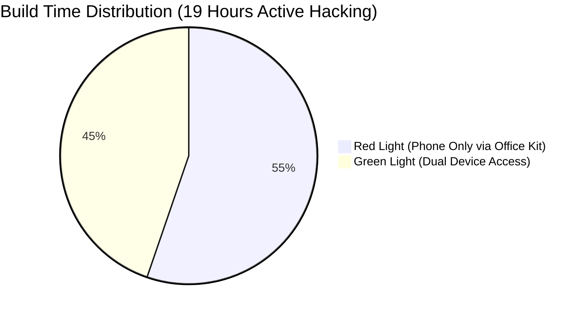

# iQOO City Battles 2026 — Rulebook & Scoring Breakdown

> [!IMPORTANT]
> **Phone-First Build Surface**: Every project must run on the loaner iQOO phone (running OriginOS 6) and be presented live on the phone. A local or open-source model running at the core earns crucial bonus points!

---

## 🏆 Overview

- **Event**: iQOO City Battles 2026 (Aug – Oct 2026)
- **Total Series Prize Pool**: **₹40,00,000** across City Battles, Finale, and Special Awards
- **Format**: 30-Hour On-Ground Battle (Sat 08:00 AM Check-in → Sun 16:15 PM Awards)
- **Grand Finale**: Oct 9–11, 2026 in Bengaluru (48 Hours)
- **Official Repository**: [sameerreddy789/IQOO_Hackathon](https://github.com/sameerreddy789/IQOO_Hackathon)

---

## 💰 Prize Pool Breakdown (Per City Battle: ₹6,00,000 Total)

Both student and professional buckets are judged separately with dedicated prize pools:

| Bucket | 🥇 Winner | 🥈 1st Runner-Up | 🥉 2nd Runner-Up | Total Pool |
| :--- | :---: | :---: | :---: | :---: |
| **Working Professionals** | **₹1,50,000** | ₹1,00,000 | ₹70,000 | **₹3,20,000** |
| **Students** | **₹1,50,000** | ₹80,000 | ₹50,000 | **₹2,80,000** |

> [!NOTE]
> The top 6 teams per city battle (3 Student + 3 Working Professional) automatically qualify for the **Grand Finale** in Bengaluru (Oct 9–11, 2026).

---

## 🚦 Build Format: Red Light vs. Green Light

The 19-hour active build window is split between two operational modes:



> [!WARNING]
> **Red Light Rules**: Laptops cannot be used directly as primary build stations. You must drive your development and testing through **Office Kit screen mirroring and remote control**.

- 🔴 **Red Light (55% / ~10.5 Hours)**: Interactive phone-only phase via Office Kit.
- 🟢 **Green Light (45% / ~8.5 Hours)**: Dual-device access (laptop + phone) for initial scaffolding, heavy compiles, overnight sprints, and final polish.

---

## 📊 Scoring Rubric (100 Points Total)

```mermaid
gantt
    title Scoring Weights Distribution
    dateFormat X
    axisFormat %s
    End Product Quality (30%)      : active, 0, 30
    Novelty & Impact (20%)         : 30, 50
    Creative Phone Use (15%)       : 50, 65
    Technical Depth (15%)          : 65, 80
    Office Kit Usage (10%)         : 80, 90
    Demo & Pitch (10%)             : 90, 100
```



| Category | Weight | Evaluated By | Key Focus Criteria |
| :--- | :---: | :---: | :--- |
| **End Product Quality** | **30%** | Jury Panel | Functional completion, UI polish, smooth UX, real-world utility |
| **Novelty & Impact** | **20%** | Jury Panel | Solution originality, market need, problem depth |
| **Creative Phone Use** | **15%** | HackTracker Telemetry | Active integration of camera, voice, local sensors & on-device AI |
| **Technical Depth** | **15%** | Jury Panel | Clean architecture, Snapdragon NPU utilization, robustness |
| **Office Kit Usage** | **10%** | HackTracker Telemetry | Cross-device bridge frequency (clipboard, mirroring, files) |
| **Demo & Pitch** | **10%** | Jury Panel | Compelling 3–5 minute live presentation on the iQOO phone |

---

## ⏱️ Weekend Schedule Timeline

```mermaid
timeline
    title 30-Hour Hackathon Roadmap
    section Saturday (Day 1)
        08:00 AM : Check-in & iQOO Loaner Handover
        10:00 AM : Opening Keynote & Office Kit Teach-in
        11:00 AM : Hacking Clock Starts (Red/Green Cycles)
        15:30 PM : Mentor Round 1
        19:00 PM : Evaluation Round 1 (Checkpoint)
    section Sunday (Day 2)
        09:00 AM : Evaluation Round 2 (Table Judging)
        12:00 PM : Code Freeze & Repo Lock
        13:30 PM : Top 10 Announcement per Bucket
        13:45 PM : Live Pitches to Full Jury
        16:15 PM : Grand Awards & Finale Qualification
```

> [!TIP]
> **Pro-Tip for High Technical Depth Score**: Deploy quantized open-source models (e.g. Llama 3 8B or Phi-3 via ONNX / ExecuTorch) directly targeting the **Snapdragon NPU**. Showing offline AI execution during judging gives you a huge advantage!
