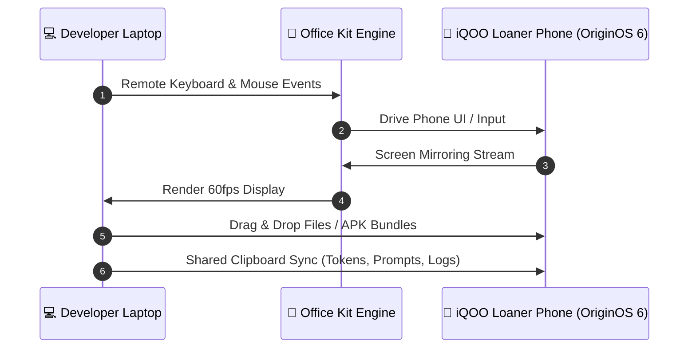

# Office Kit & Red Light Strategy Guide

> [!NOTE]
> **Office Kit Bridge**: Download official desktop software from [`pc.vivoglobal.com`](https://pc.vivoglobal.com/) (Windows 10+ / macOS 10.14.6+). Your loaner iQOO phone comes with OriginOS 6 pre-installed and ready to pair.

---

## 🖥️ Office Kit Core Architecture

Office Kit bridges your laptop and iQOO phone into a single development workflow:

---

## 🚦 Strategic Split: Red Light vs. Green Light

> [!WARNING]
> During **Red Light**, your laptop lid must remain closed as a main coding station. You can only interact with your build via the **Office Kit remote interface**.

| Phase | Time Share | Operational Constraints | Dev Team Strategy |
| :--- | :---: | :--- | :--- |
| 🟢 **Green Light** | **45%** (~8.5 hrs) | Both devices fully open | App scaffolding, dependency installs, model quantization, NPU compilation, repo pushes |
| 🔴 **Red Light** | **55%** (~10.5 hrs) | Laptop restricted; build strictly driven via Office Kit | Phone UI refinement, remote debugging, prompt engineering, live sensor testing |

---

## 💡 How to Score 100% on Office Kit Telemetry (10 Points)

HackTracker measures hardware bridge activity in the background. Follow this protocol to maximize telemetry metrics:

> [!TIP]
> **Telemetry Maximizer Checklist**:
>
> 1. ✅ **Keep Office Kit Connected Continuously**: Never disconnect the bridge during hacking hours.
> 2. 📋 **Use Shared Clipboard for Everything**: Transfer API keys, JSON payloads, prompt strings, and log traces using `Ctrl+C` on laptop $\rightarrow$ `Ctrl+V` on phone.
> 3. 📂 **Transfer Build Bundles via File Drag-and-Drop**: Push APKs or PWA bundles directly across the bridge.
> 4. ⌨️ **Use Remote Control Input**: Use your laptop keyboard via screen mirror to interact with phone text fields.

---

## 🛠️ Red Light Developer Velocity Hacks

> [!CAUTION]
> Avoid getting blocked during Red Light phases by setting up live hot-reload before Red Light starts!

1. **Local Network Tunnel / Live Reload**:
   - Serve your web app / React Native Metro bundler over local Wi-Fi or USB reverse port forwarding (`adb reverse tcp:3000 tcp:3000`).
   - Edit files on laptop, see instant UI updates on the mirrored iQOO screen without touching phone controls!

2. **On-Device Inference Pipeline**:
   - Run local SLM endpoints (e.g. ExecuTorch / ONNX Runtime) on the Snapdragon NPU.
   - Keep log viewer open in Office Kit screen mirror to observe real-time NPU latency and memory footprint.
