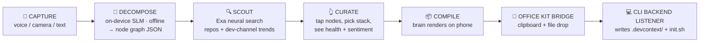

# PROJECT_DEVCONTEXT_SPEC: DevContext AI Product & Architecture Blueprint

> [!IMPORTANT]
> **Scope Status: LOCKED.** This document is the single source of truth for the DevContext AI build. Architecture was deliberately reduced from 15 modules to 5 components to guarantee delivery inside the 19-hour on-site window. Anything in the [Explicit Cut List](#5-explicit-cut-list-post-hackathon-production-roadmap) is out of scope and stays out.

- **Track**: #6 Developer Tools (City Battles + National Grand Finale eligible)
- **Event**: iQOO City Battles 2026 — Chennai City Battle, 12–13 September 2026
- **Related docs**: [Rules & Scoring](./HACKATHON_RULES_AND_SCORING.md) · [Phase 1 Requirements](./PHASE_1_SUBMISSION_REQUIREMENTS.md) · [Office Kit Strategy](./OFFICE_KIT_AND_RED_LIGHT_STRATEGY.md) · [Tracks Guide](./TRACKS_AND_IDEATION_GUIDE.md)

---

## 1. Vision & Core Value Proposition

DevContext AI is an autonomous, phone-first architectural blueprinting canvas built for early-career developers and engineering students in India. Instead of attempting to build a subpar mobile IDE, the tool acts as a contextual scaffolding workspace that runs alongside a developer's native desktop environment.

Using on-device multi-modal input (camera and microphone) and a fully offline local structural model, it lets a developer visually architect a project, scout open-source tooling semantically, and compile a persistent local "Brain Folder" (`.devcontext/`) straight into their IDE root over the iQOO Office Kit bridge.

The core bet: the most expensive hour of any project is the first one, and it is currently spent in browser tabs. DevContext AI moves that hour onto the phone, makes it visual, and leaves behind a durable artifact instead of a closed tab.

---

## 2. Target Indian Persona Definition

- **The Blueprint User**: Early-career developers at Indian IT service providers (TCS, Infosys, Wipro, Cognizant) and Tier-2/Tier-3 college engineering students.

- **The Core Pain Point**: These builders are frequently assigned to projects where they must spin up modern full-stack scaffolding from scratch with minimal access to senior system architects. They lose hundreds of hours copy-pasting clashing open-source boilerplate, misconfiguring dependency setups, and missing critical community signals (Reddit bug threads, deprecation notices, maintenance-dead repositories) during early system planning.

- **Why the phone is the right surface**: This persona's decision-making happens away from the desk — in standups, on commutes, in hostel rooms, in front of a whiteboard. The blueprint phase is mobile even when the build is not.

---

## 3. The 5-Component Reshaped Architecture Flow



### Component Breakdown

**1. CAPTURE — Sensory Input Layer**
Handles real-time on-device voice transcription for spoken system requirements, and processes camera frames using Google ML Kit on-device OCR to read physical whiteboard flowcharts and structural layout drawings. Plain text entry remains available as the fallback path.

**2. DECOMPOSE — On-Device Local AI Orchestration**
Runs a quantized Small Language Model locally through ONNX Runtime / ExecuTorch directly on the smartphone, targeting the Snapdragon NPU. It maps raw text and OCR output into a standardized structural JSON node tree representing application requirements. This runs fully offline — no network, no localhost, no cloud round-trip. Under the hackathon's Red Light constraint, decomposition keeps working when the laptop is locked and connectivity is unreliable.

**3. SCOUT — Semantic Search & Sentiment Pipeline**
The Flutter client issues direct HTTPS requests to the **Exa AI Neural Search API**, eliminating any intermediary desktop localhost backend. Parallel semantic queries scout relevant open-source libraries across public Git hosts (GitHub, GitLab, Bitbucket), while a second domain-filtered pass assesses community sentiment and open bug complaints across developer channels on Reddit, X, and LinkedIn.

**4. CURATE — Visual Interactive Canvas**
A high-fidelity interactive node-graph interface built natively in Flutter. The developer taps individual requirement nodes, previews package health metrics, opens documentation through an embedded webview, and selects their final system components.

**5. COMPILE — The Context Artifact Engine**
Compiles the finalized node graph into a packed payload. The phone renders a live preview of `context.json` and the generated `init.sh` on screen, then pushes the payload across the **iQOO Office Kit bridge** using shared clipboard and file transfer. A lightweight CLI listener running on the host laptop receives that payload and serializes the files directly into the target workspace folder.

> [!NOTE]
> The CLI listener is the component that performs the actual filesystem write. The Office Kit bridge transports the payload; it does not create directories. Naming both makes the handoff claim technically accurate.

---

## 4. Hackathon Rubric Alignment Matrix

| Rubric Evaluation Axis | Architecture Implementation Strategy |
| :--- | :--- |
| **On-Device NPU AI Integration** | The SLM decomposition engine runs natively on-device and functions fully offline. Requirement similarity matching uses an ONNX embedder pipeline accelerated by the Snapdragon NPU. |
| **Hardware & Sensory Inputs** | Camera parsing (whiteboard flowchart OCR via ML Kit) plus microphone transcription (speech-to-text requirement intake), keeping the phone as the active operational cockpit rather than a display. |
| **iQOO Office Kit Bridge Interaction** | The compilation handoff uses shared clipboard *and* file transfer, hooked into a lightweight desktop CLI directory writer. Bridge activity is generated by the core product loop, not by ceremony added for telemetry. |
| **Indian Persona Utility** | Solves the structural guidance vacuum experienced by junior developers and engineering students across India's services-heavy tech landscape. |
| **Product Delivery Feasibility** | Scope reduced from 15 disjointed modules to a concise 5-component stack, eliminating the custom cloud backend layer entirely. Keeps the build viable inside 19 on-site hours. |
| **Demo & Pitch** | The compiled brain renders on the phone screen *before* the laptop handoff, so the demo climax stays on the device the jury is watching. |

---

## 5. Explicit Cut List (Post-Hackathon Production Roadmap)

Each item below was a deliberate removal, not an oversight. They form the post-hackathon roadmap.

| Cut Component | Rationale & Replacement |
| :--- | :--- |
| **Synchronized Cloud Web Canvas** | Removed to protect build speed. A second frontend doubles UI surface for zero rubric gain — scoring rewards the phone. |
| **Greptile + CrewAI/LangGraph Multi-Agent Stack** | Replaced with single-pass direct JSON mapping from a tightly structured local SLM prompt. Multi-agent routing added latency and failure modes without changing output quality at this scope. |
| **Dedicated Qdrant / ChromaDB Docker Servers** | Replaced with lightweight file-based on-device vector storage. A container dependency contradicts the phone-first, offline-capable premise. |
| **GitHub OAuth + AES-256 Cloud Vault Layer** | Deferred past the hackathon. The localhost OAuth callback flow cannot function during Red Light windows, making it actively hostile to the build format. |
| **Automated `.contextignore` Engine** | Replaced with manual toggle switches on the visual Flutter node cards — same outcome, visible in the demo, a fraction of the work. |
| **FastAPI Orchestration Backend** | Eliminated. The Flutter client calls Exa directly over HTTPS, which removes the localhost dependency that would have stalled 55% of the build window. |

---

## 6. The Target Handoff Output: The `.devcontext/` Brain Folder

On compilation, the CLI listener delivers this structure into the root of the target workspace on the PC:

```text
my-target-project/
├── .devcontext/                 <-- THE PROJECT CONTEXT "BRAIN"
│   ├── context.json             <-- Structural choices, chosen nodes, stack configuration, rationale
│   ├── semantic_cache.db        <-- Portable vector store of requirement embeddings
│   ├── open_source_maps/        <-- Vetted repository documentation as markdown
│   └── trends_report.md         <-- Consolidated Reddit/social feedback and vulnerability logs
└── init.sh                      <-- Auto-generated system bootstrap script
```

### Why the artifact matters

- **`context.json`** is a structural ledger recording not just *what* stack was chosen but *why*. It stays in the repository as a permanent guide for downstream AI coding tools and for human teammates joining later.
- **`init.sh`** is executable on arrival. The developer opens their IDE, runs `bash init.sh`, and the terminal clones the selected open-source modules, maps paths, and initializes dependencies.
- **`trends_report.md`** captures the community signal that would otherwise have been missed — the Reddit thread explaining that a chosen library has been unmaintained for 14 months.

---

## 7. Build Split: Tonight vs. On-Site

| Layer | Phase 1 (tonight, solo) | On-Site Chennai (19 hrs, full team) |
| :--- | :--- | :--- |
| CAPTURE | — | Camera OCR + mic STT on the loaner phone |
| DECOMPOSE | Prompt, schema and validator proven against a local quantized ONNX model on laptop | Same artifacts ported to on-device ONNX Runtime, NPU-accelerated |
| SCOUT | Working Exa integration, real repos and real Reddit sentiment | Called directly from the Flutter client |
| CURATE | Delegated to deck owner as a design mock | Built natively in Flutter |
| COMPILE | Working CLI generator producing the full `.devcontext/` tree | Wired to the Office Kit bridge payload |

The decomposition prompt, JSON schema, and validator are deliberately built first because they are the highest-uncertainty part of the on-device claim. Mobile runtime integration is mechanical by comparison and belongs in a Green Light window with the real device in hand.

See [ONSITE_BUILD_PLAN.md](./ONSITE_BUILD_PLAN.md) for the hour-by-hour on-site schedule.
