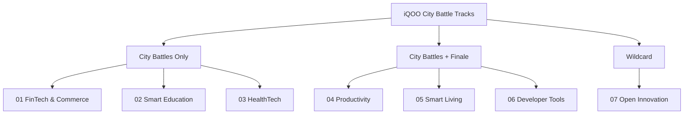

# iQOO City Battles 2026 — Tracks & Problem Selection Framework

> [!IMPORTANT]
> **Brownie Points Criteria**: Every track entry MUST leverage a **local or open-source model at its core**, running on or bridged to the phone with active **Office Kit** integration.

---

## 🎯 Track Landscape & Hardware Integration Matrix

---

## 💡 Track Breakdown & High-Scoring Concept Ideas

### 1. FinTech and Commerce (City Battles Only)

> **Domain**: Money, payments, commerce, lending, investing, financial inclusion for India.

- ⚙️ **Hardware / Sensor Hooks**: Camera OCR, local NPU document verification, offline audio feedback.
- 💡 **High-Scoring Concept Idea — *iQOO PayShield Local***:
  - An offline-first merchant payment & fraud detection assistant.
  - Runs quantized local SLM on Snapdragon NPU to inspect invoices, verify QR signatures offline, and provide instant voice confirmation in local Indian languages.

---

### 2. Smart Education (City Battles Only)

> **Domain**: AI tutoring, study workflows, assessment, skilling, classroom ops.

- ⚙️ **Hardware / Sensor Hooks**: Camera problem scanner, voice microphone examiner, Office Kit notes bridge.
- 💡 **High-Scoring Concept Idea — *iQOO SnapTutor AI***:
  - Point phone camera at any math problem, diagram, or textbook page.
  - On-device vision model extracts text/geometry and generates instant step-by-step interactive tutoring, pushing summary cheat sheets directly to laptop via Office Kit.

---

### 3. HealthTech (City Battles Only)

> **Domain**: Healthcare, wellness, fitness, mental health, triage.

- ⚙️ **Hardware / Sensor Hooks**: Camera posture & PPG pulse detection, accelerometer, privacy-first local AI.
- 💡 **High-Scoring Concept Idea — *iQOO VitalGuard local***:
  - Privacy-preserving personal health monitor running 100% on-device (zero cloud health data transfer).
  - Uses phone camera for real-time PPG vital estimation (heart rate & respiratory rate) and local SLM for triage assessment.

---

### 4. Productivity (City Battles + Finale)

> **Domain**: Automate repetitive tasks, time management, workflow optimization.

- ⚙️ **Hardware / Sensor Hooks**: Office Kit clipboard listener, background voice recording, Snapdragon NPU transcription.
- 💡 **High-Scoring Concept Idea — *iQOO OfficeBridge Flow***:
  - Cross-device meeting & workflow copilot.
  - Phone captures live audio $\rightarrow$ Snapdragon NPU transcribes & extracts action items in real-time $\rightarrow$ streams structured task cards to laptop workspace via Office Kit.

---

### 5. Smart Living (City Battles + Finale)

> **Domain**: Smart home, IoT, connected devices, everyday convenience.

- ⚙️ **Hardware / Sensor Hooks**: Bluetooth Low Energy (BLE), camera gesture recognition, local voice commands.
- 💡 **High-Scoring Concept Idea — *iQOO HomeVision Hub***:
  - On-device spatial gesture and camera-based smart home orchestrator.
  - Process spatial camera gestures using lightweight local vision models without sending home video feeds to external clouds.

---

### 6. Developer Tools (City Battles + Finale)

> **Domain**: Developer workflow, mobile app testing, debugging, deployment.

- ⚙️ **Hardware / Sensor Hooks**: ADB bridge, Office Kit remote inspect, on-device log analyzer.
- 💡 **High-Scoring Concept Idea — *iQOO DevLens AI***:
  - Mobile performance, layout, and crash diagnostic agent running directly on the loaner phone.
  - Analyzes phone UI frame rates, battery drain, and memory leaks using local AI, sending instant patch suggestions to laptop editor via Office Kit.

---

### 7. Open Innovation (Wildcard — Everywhere)

> **Domain**: Anything outside traditional track definitions with a local/open-source model core.

---

## 🏆 Scoring Optimization Strategy (Hitting 100/100)

> [!TIP]
> **Checklist for Maximum Jury & Telemetry Score**:
>
> - 🟢 **30% Product Quality**: Clean, responsive UI built specifically for the iQOO flagship display.
> - 🟢 **20% Novelty**: Solves a real, painful problem with an original twist.
> - 📱 **15% Creative Phone Use**: Active hardware use (Camera + Mic + Sensors + NPU).
> - 💻 **15% Technical Depth**: Quantized local model running on Snapdragon NPU + clean architecture.
> - 🔄 **10% Office Kit**: Shared clipboard, file transfer, and screen remote control.
> - 🎙️ **10% Pitch**: Clear 3–5 minute live demonstration running directly on the loaner phone.
